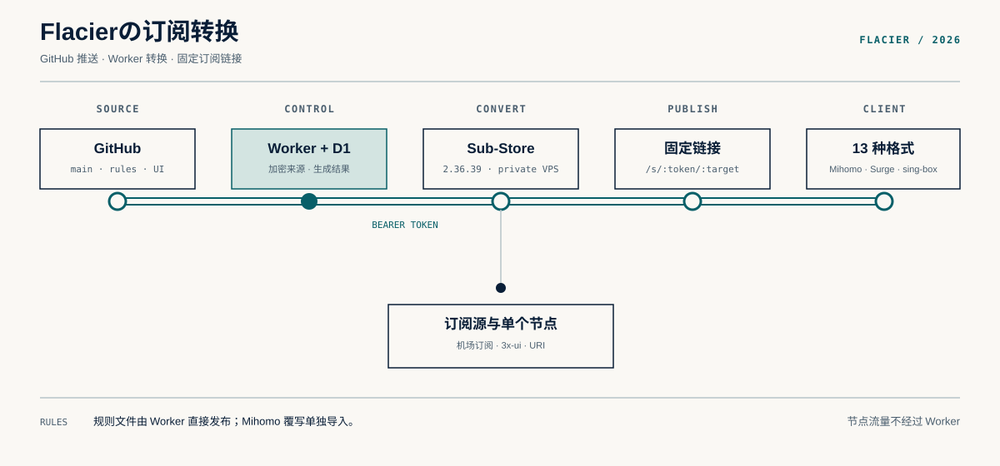

<h1> Flacierの订阅转换</h1>

个人订阅转换、分流规则和网址测试。

[在线页面](https://rules.flacier.com/) · [Mihomo 覆写](https://rules.flacier.com/overrides/clash-party.yaml) · [规则目录](public/rules/manifest.yaml)



## 功能

- 合并多个订阅和单节点，生成 KV 短链接
- 客户端刷新时读取上游并转换，链接不用重新生成
- Clash Verge、FlClash、Clash Party、Mihomo 等完整配置；Shadowrocket 等节点订阅
- 节点筛选、多重改名、国旗、类型、UDP、XUDP 与排序
- 透传、合并上游流量与到期信息
- 默认 Worker 转换；可选 Clash Party / Mihomo 客户端直读备用
- 继承原订阅 DNS，或选择代理 DoH
- CF、本地及自定义 Flacier 后端；ACL4SSR 和自定义远程规则模板
- BrowserLeaks、IPv6、Cloudflare 网络检测入口
- AI、Apple、Steam、Discord、Bilibili、AniGamer 等分流规则
- 网址规则测试与规则格式转换

规则文件位于 [`public/rules`](public/rules)，Mihomo 覆写单独导入：

```text
https://rules.flacier.com/overrides/clash-party.yaml
```

## 开发

```bash
pnpm install
pnpm dev
pnpm check
```

部署使用 Cloudflare Git 集成，见 [Cloudflare 配置](docs/cloudflare-setup.md)。

本地转换：`pnpm build && pnpm start:local`，打开 `http://127.0.0.1:25500`。用量、DNS 与手机端说明见 [客户端配置](docs/clients-and-dns.md)。

## License

[AGPL-3.0](LICENSE) · [Third-party notices](THIRD_PARTY_NOTICES.md)
